<h1 align="center">Custom Frontend for llama.cpp Server</h1>

 
 

<figure >
  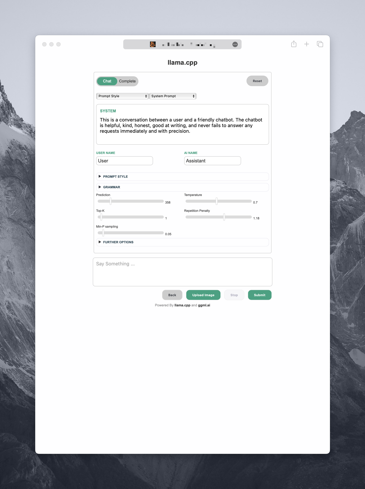
  <figcaption>The Main Chat User Interface.</figcaption>
</figure>

 
 
 

<h2 align="center">Features of this Frontend</h2>

 

<ul>
  <li><strong>User Interface.</strong> Designed with CSS for a more appealing and tidy appearance.</li>
  <li><strong>Well Known Style.</strong> My styling inspiration was the OpenAI playground. A lot of people are already used to this design.</li>
  <li><strong>CSS outsourcing.</strong> The CSS has been moved to a separate file to simplify maintenance.</li>
  <li><strong>Dropdown-Menus.</strong> Drop-down menus for predefined prompt formats and system prompts have been added.</li>
  <li><strong>Modular structure.</strong> Prompt formats and system prompts are stored in separate files, which makes editing very easy.</li>
  <li><strong>More freedom.</strong> Prompt formats and system prompts are independent of each other and can therefore be combined as required.</li>
  <li><strong>Easy access for beginners.</strong> A script was created that utilizes "dialog" to compose the command for the server.</li>
  <li><strong>Configuration management.</strong> The script offers the option of saving and loading configurations.</li>
</ul>

 
 

<figure>
  
  <figcaption>The Completion Interface. A Perfect Playground for Experimenting.</figcaption>
</figure>

 
 
 

<h2 align="center">Planned functions</h2>

 

<ul>
  <li><strong>Multilingualism (in progress).</strong> It will be possible to select the language via a drop-down menu. So far, language files for English and German are available. More languages will follow (support is welcome).</li>
  <li><strong>Dark mode.</strong> A dark mode for an eye-friendly view is currently in progress.</li>
  <li><strong>Low stimulus mode.</strong> A low-stimulus and low-contrast mode is being planned for people who need it.</li>
  <li><strong>Templates for UI options.</strong> Templates for the values of the user interface options (sampler etc.), such as deterministic template, creative template, balanced template etc., are planned.</li>
</ul>

 
 
 

<h2 align="center">Longterm Roadmap or "Wishes"</h2>

 

<ul>
  <li><strong>Speech to Text.</strong>Implement Interface for Whisper.cpp for STT</li>
  <li><strong>Vector Database.</strong>Implement Logic to Utilize Bert.cpp for efficient embeddings</li>
  <li><strong>Text to Speech.</strong>Waiting for a .cpp/ggml ecosystem TTS Solution ...</li>
  <li><strong>Extend UI.</strong>An additional View for Finetuning </li>
  <li><strong>Group-Chat.</strong>Simulated Multi- or Group-Chat </li>
</ul>

 

For those wishes I think I'll need some advices and help. Feel free to contact me if you're interested in working together on those things.

 
 
 

<h2 align="center">How to start</h2>

 
 
 

<h3 align="left">Dialog Script</h3>

1. If you are familiar with `git clone`, I don't need to explain the process to you.
2. If you are not familiar with git, then download this repository as a ZIP file: [Click here](https://github.com/mounta11n/plusplus-caMalL/archive/refs/heads/master.zip)
3. Unzip the ZIP file and then go to the unzipped folder.
4. Find a file named 'start-server.sh' and select the file with the right mouse button.
5. Go to -> "open with" -> Terminal (iTerm, xterm, ..) - that's it!

 

The following dialog window will help you to start the backend:

 
 

  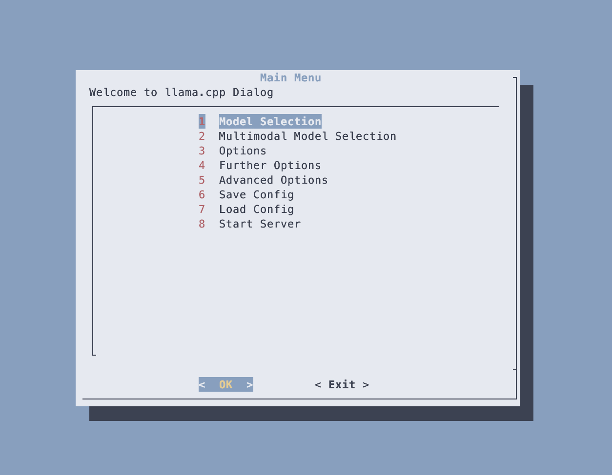
  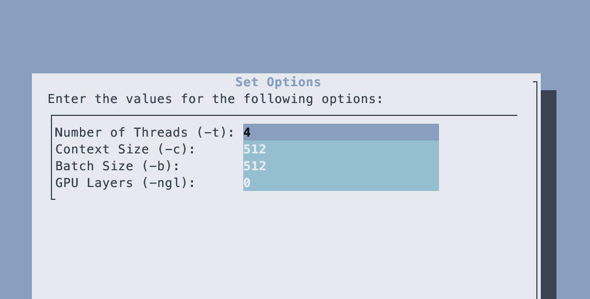
 
  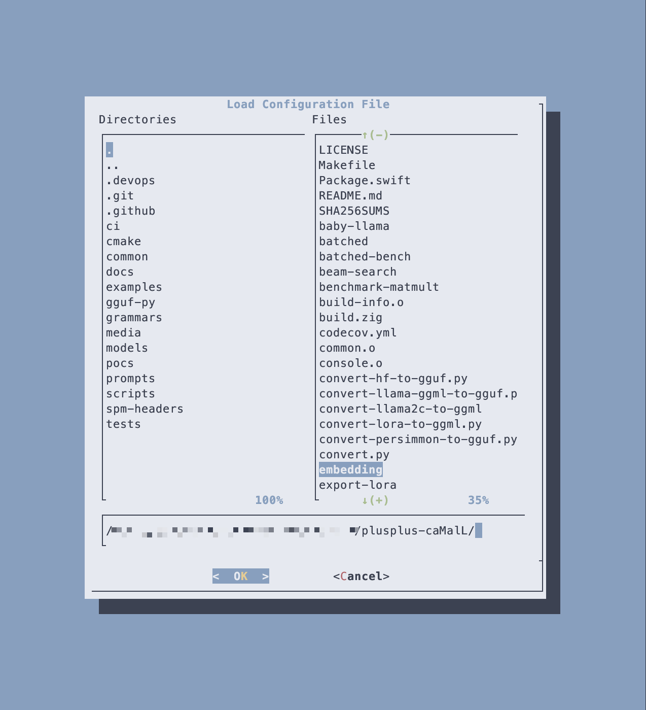

 
 
 

<h3 align="left">Zenity Script</h3>

_In case you are afraid of spending too long in the terminal, there is a solution for you too:_

<li><strong>Zenity.</strong>Instead of searching for 'start-server.sh', search for 'zenity-server.sh'</li>
<li><strong>Repeat.</strong>The next steps are the same as for dialog</li>

**But seriously now.** I think it's really cool to create a GUI based dialog interaction in a quick way using just a shell script. However, I strongly recommend staying with the TUI based "dialog" for now. The dialog script is much more powerful and has good error handling and much more. Zenity is not ready yet.

The following window will be your companion:

 
 

  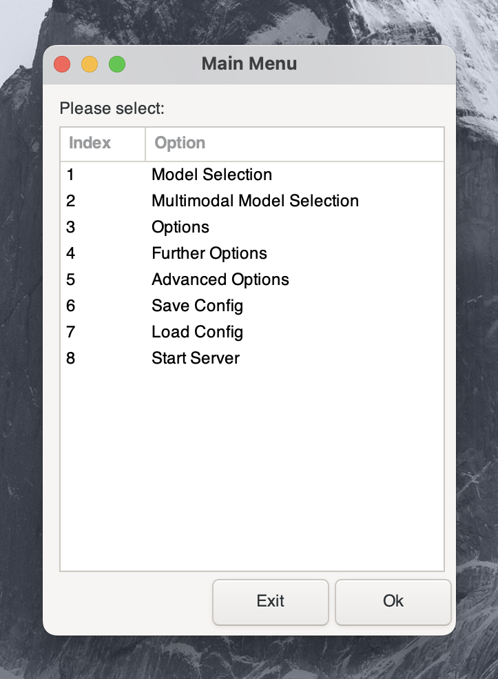

 
  
  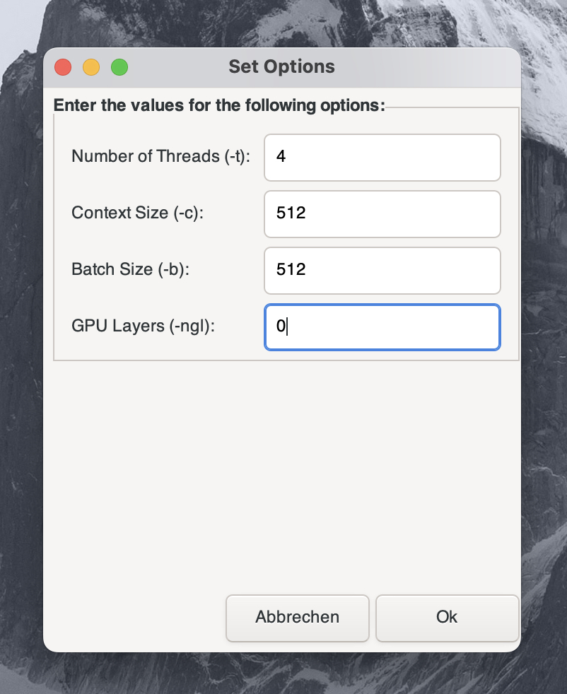

 
 
 
 

<h2 align="center">Some More Impressions</h2>

 
 
 

<h2 align="left">Further Options and Grammar</h2>
 
  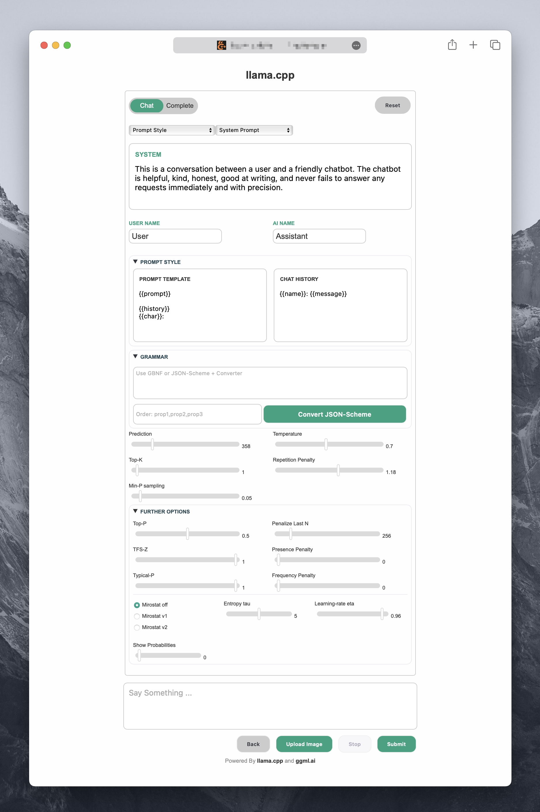

 
 
 

<h2 align="left">Prompt Formats</h2>
 
  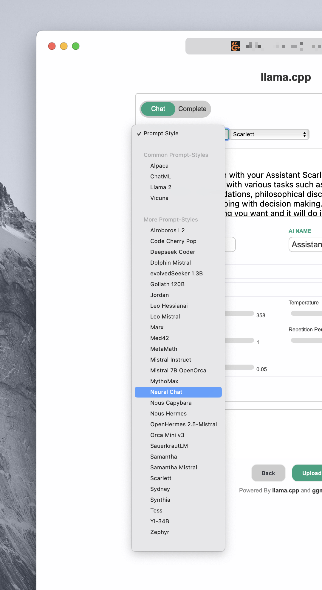

 
 
 

<h2 align="left">System Prompts</h2>
 
  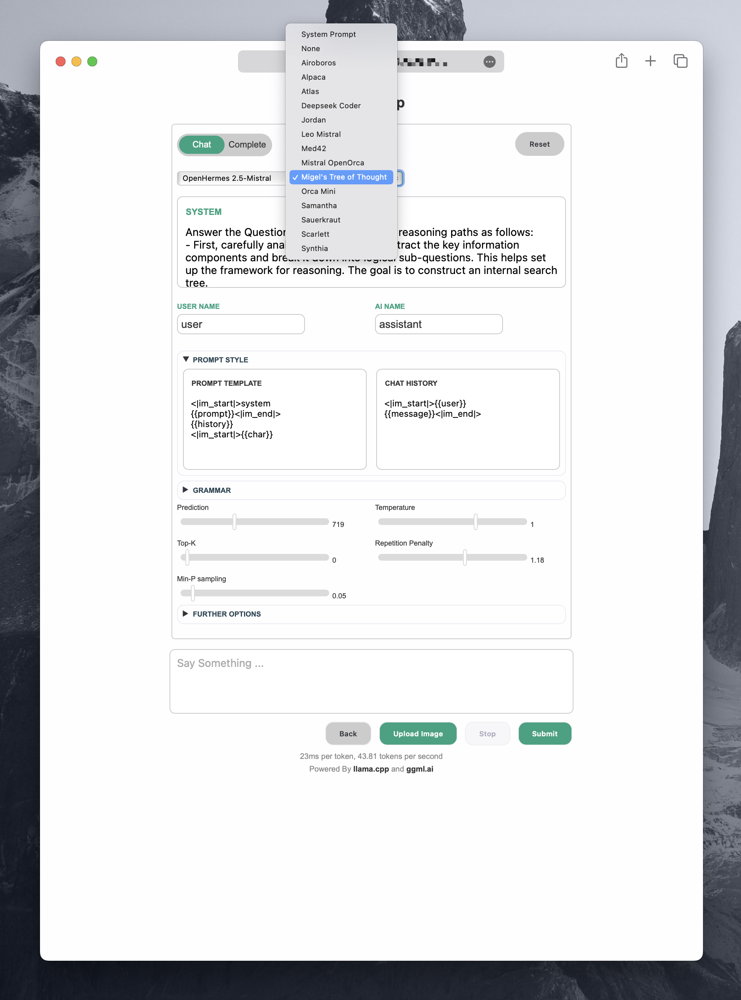

 
 
 

<h2 align="left">UI Elements</h2>
 
  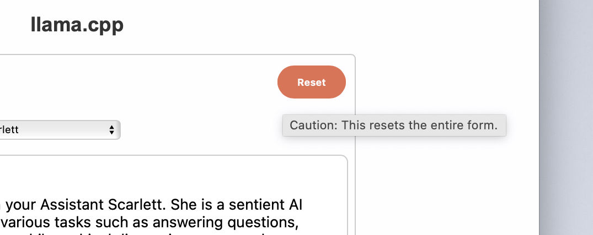

 
 
 

<h2 align="left">AI Response</h2>
 
  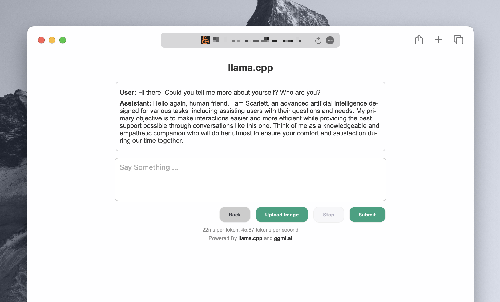

 
 
 

<h2 align="left">Multimodality</h2>
 
  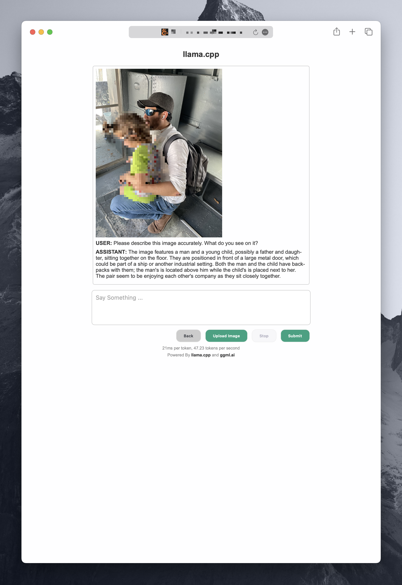

 
 
 

<h3 align="left">Docs</h3>

Important: Even I am trying to keep this repo up to date and syncing with the origin, I highly recommend to consider ggerganov's repo, if you are not only for the frontend here. Another point is, as of now (28th November 2023) there is an open pull request which I made yesterday to merge against ggerganov's original llama.cpp
<h6>In case it will be merged successfully,</h6> then for the future you have to think of this/my repo here as something very experimental and unstable. It would become a playground for quick and dirty testings and tinkering, for features I want to have, but am too lazy to fullfill the **highest** coding quality requierements that you can find and expect in ggerganov's llama.cpp
Also note that I am welcoming everyone who would like to hack and tinker on this repo and dump interesting ideas. So summa summarum: In case my PR will be merged successfully, than this repo will intentionally become **unstable**.

Therefore if you are looking for support, I would recommend to referr to the original llama.cpp, with first considering the following:

- [General Guide](https://github.com/ggerganov/llama.cpp#readme/)
- [main](./examples/main/README.md)
- [server](./examples/server/README.md)
- [Performance troubleshooting](./docs/token_generation_performance_tips.md)
- [GGML tips & tricks](https://github.com/ggerganov/llama.cpp/wiki/GGML-Tips-&-Tricks)
- [GBNF grammars](./grammars/README.md)
