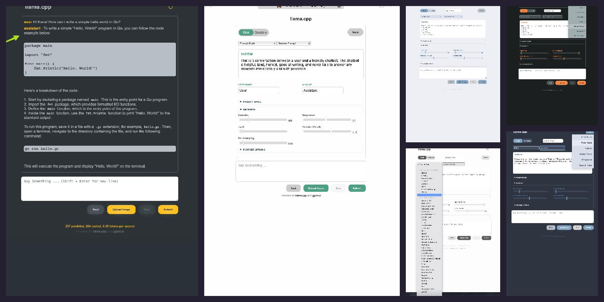

 
 
<h1>Let's play llama.cpp</h1>
 

**This branch is intended as a playground for educational and research purposes. I love llama.cpp and use it or deal with it every day - and it is quite self-explanatory that not every conceivable feature can be implemented or every user request realized. Not only would such an approach contradict the basic philosophy of llama.cpp, but the resources of the main developers are limited.
Nonetheless, I personally would sometimes like to know *what if* ... what if we were to use a certain sampler that doesn't exist in llama.cpp? Or what if we extended the server with functions from the in-house ggml library, e.g. bert.cpp or sd.cpp?**

**And I think that llama.cpp is the best framework and backend for acquiring your own expertise in the areas of LLMs, neural networks, transformers etc. through learning by doing and self-study.**

**If it turns out that the added value of an extension goes beyond the mere satisfaction of curiosity and the urge to experiment, then it should be considered to create a clean code and a pull request from it so that the whole community could benefit from it.**

 
 
<h2>Successfully completed and merged works</h2>
 
<h3>New Server UI</h3>
 
Some improvements regarding the aesthetics to make the server ui looks nicer and additionally some needed functionalities like the prompt format templates.
 
 
 
 
<figure >
    <h4>The new UI with 6 different color themes.</h4>
     
  
  <figcaption></figcaption>
</figure>
 
 
 
 
<figure >
    <h4>With attention for finer details.</h4>
     
  
  <figcaption></figcaption>
</figure>

 
 
 
 
<h2>Things I am currently working on</h2>
 
<h3>TUI to start the server</h3>
 
A shell script that utilizes the <a href="https://linuxcommand.org/lc3advdialog.php">dialog</a> tool to compose the right command you need to start the server. 
It can also automatically find .gguf files on your computer and additionally save and load configurations/commands. 
 
 
<figure >
  
</figure>
 
 
<h3>GUI to start the server</h3>
 
Same as above but this version utilizes yad or zenity to start a graphical interface. 
 
 
<figure >
  
</figure>
 

 
 
 
 
<h2>Things that are worth it to be considered next</h2>
 

<ul>
  <li><strong>DRY (in progress).</strong> Very promising sampling method (todo: add url -> reddit.</li> 
  <li><strong>Multilingualism (in progress).</strong> Select a language via a drop-down menu.</li> 
  <li><strong>Speech to Text.</strong> Implement Interface for Whisper.cpp for STT</li> 
  <li><strong>Vector Database.</strong> Implement Logic to Utilize Bert.cpp for efficient embeddings</li> 
  <li><strong>Text to Speech.</strong> Waiting for a .cpp/ggml ecosystem TTS Solution ...</li> 
  <li><strong>Extend UI.</strong> An additional (tab?)-View for Finetuning </li> 
  <li><strong>Group-Chat.</strong> Simulated Multi- or Group-Chat </li>
</ul>
 
 

I would be happy for any feedbacks, advices, help and contributions. Feel free to contact me if you're interested in working together on those things.

 
 
 

<h3 align="left">Docs</h3>

If you are looking for support, I would recommend to referr to the original llama.cpp, with first considering the following:

- [General Guide](https://github.com/ggerganov/llama.cpp#readme/)
- [main](./examples/main/README.md)
- [server](./examples/server/README.md)
- [Performance troubleshooting](./docs/token_generation_performance_tips.md)
- [GGML tips & tricks](https://github.com/ggerganov/llama.cpp/wiki/GGML-Tips-&-Tricks)
- [GBNF grammars](./grammars/README.md)
