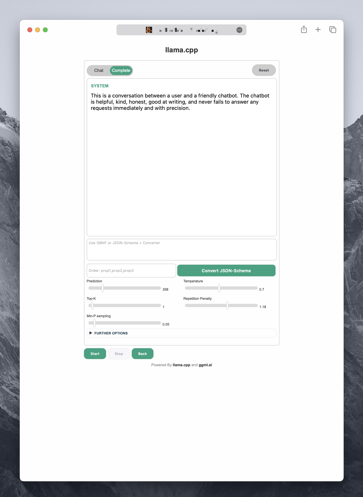

<h1 align="center">Custom llama.cpp Frontend</h1>

**This is a fork, but it adresses only the the server and its web UI. This work will maybe become merged against the upstream. In that case this repo will eventually become to something like a playground for quick and dirty experiments and tinkerings, while the merged frontend at ggerganov/llama.cpp will be a stable and well maintained version**

 
 

<figure >
  
  <figcaption>The Main Chat User Interface.</figcaption>
</figure>

 
 
 

 
 

<figure >
  
  <figcaption>Dark Mango llama.cpp.</figcaption>
</figure>

 
 
 
<h2 align="center">Features of this Frontend</h2>

 

<ul>
  <li><strong>User Interface.</strong> Designed with CSS for a more appealing, clean and tidy appearance.</li> 
  <li><strong>Well Known Style.</strong> My initial styling inspiration was the OpenAI playground. A lot of people are already used to this design. But in the meantime I have made some more color themes.</li> 
  <li><strong>Dark and Light Themes.</strong> As mentioned, there are now some color themes to choose from.  
  <li><strong>CSS outsourcing.</strong> The CSS has been moved to separate files to simplify maintenance and hacking.</li> 
  <li><strong>Dropdown-Menus.</strong> Convenient Drop-down menus for predefined prompt formats and system prompts have been added.</li> 
  <li><strong>Modular structure.</strong> Prompt formats and system prompts are stored in separate files, which makes editing very easy.</li> 
  <li><strong>More freedom.</strong> Prompt formats and system prompts are independent of each other and can therefore be combined as required.</li> 
  <li><strong>Added a lot of tooltips.</strong> With comprehensible explanations regarding each parameter.</li> 
  <li><strong>Easy access for beginners.</strong> A script was created that utilizes "dialog" to compose the command for the server.</li> 
  <li><strong>Configuration management.</strong> The script offers the option of saving and loading configurations.</li>
</ul>
 
 

<figure>
  
  <figcaption>The new default UI</figcaption>
</figure>

 
 
 
 

 
 

<figure>
  
  <figcaption>From the old UI just press on "New UI"</figcaption>
</figure>

 
 
 
 
 
 

<figure>
  
  <figcaption>A very popular color theme: "Nord"</figcaption>
</figure>

 
 
 
 

<figure>
  
  <figcaption>The Completion Interface. A Perfect Playground for Experimenting.</figcaption>
</figure>

 
 
 

<h2 align="center">Planned functions</h2>

 

<ul>
  <li><strong>Multilingualism (in progress).</strong> It will be possible to select the language via a drop-down menu. So far, language files for English and German are available. More languages will follow (support is welcome).</li> 
  <li><del><strong>Dark mode.</strong> A dark mode for an eye-friendly view is currently in progress.</del></li> 
  <li><strong>Low stimulus mode.</strong> A low-stimulus <del>and low-contrast</del> mode (not more after reading <a href="https://blog.pope.tech/2022/11/08/color-contrast-accessibility-requirements-explained/">this</a>) is being planned for people who need it.</li> 
  <li><del><strong>Templates for UI options.</strong> Templates for the values of the user interface options (sampler etc.), such as deterministic template, creative template, balanced template etc., are planned.</del></li>
</ul>

 
 
 

<h2 align="center">Longterm Roadmap or "Wishes"</h2>

 

<ul>
  <li><strong>Speech to Text.</strong> Implement Interface for Whisper.cpp for STT</li> 
  <li><strong>Vector Database.</strong> Implement Logic to Utilize Bert.cpp for efficient embeddings</li> 
  <li><strong>Text to Speech.</strong> Waiting for a .cpp/ggml ecosystem TTS Solution ...</li> 
  <li><strong>Extend UI.</strong> An additional View for Finetuning </li> 
  <li><strong>Group-Chat.</strong> Simulated Multi- or Group-Chat </li>
</ul>

 

For those wishes I think I'll need some advices and help. Feel free to contact me if you're interested in working together on those things.

 
 
 

<h2 align="center">How to start</h2>

 
 
 

<h3 align="left">Build manually</h3>

1. Clone this repo `git clone https://github.com/mounta11n/plusplus-camall.git && cd plusplus-camall`  
2. Make sure you are on the right branch, which is **not** master `git switch plusplus`  
3. Compile the Server `mkdir build && cd build` `cmake ..` `make server`  

 

<h3 align="left">Run the Server</h3>

1. `./bin/server -m /path/to/your/model.gguf`  

2. In your browser open `localhost:8080`
 
 
 
 

<h2 align="center">Some More Impressions</h2>

 
 
 

<h2 align="left">Further Options and Grammar</h2>
 
  

 
 
 

<h2 align="left">Prompt Formats</h2>
 
  

 
 
 

<h2 align="left">System Prompts</h2>
 
  

 
 
 

<h2 align="left">UI Elements</h2>

 
 
 

<figure>
  
  <figcaption></figcaption>
</figure>
 
 
 
 
 

<figure>
  
  <figcaption>Crafted with attention to detail. Text selection adapts its color.</figcaption>
</figure>
 
 
 
 
 
 

<figure>
  
  <figcaption>Get more Info when you hover over the text.</figcaption>
</figure>

 
 
 
 

<h2 align="left">AI Response</h2>
 
  

 
 
 

<h2 align="left">Multimodality</h2>
 
  

 
 
 

<h3 align="left">Docs</h3>

If you are looking for support, I would recommend to referr to the original llama.cpp, with first considering the following:

- [General Guide](https://github.com/ggerganov/llama.cpp#readme/)
- [main](./examples/main/README.md)
- [server](./examples/server/README.md)
- [Performance troubleshooting](./docs/token_generation_performance_tips.md)
- [GGML tips & tricks](https://github.com/ggerganov/llama.cpp/wiki/GGML-Tips-&-Tricks)
- [GBNF grammars](./grammars/README.md)
